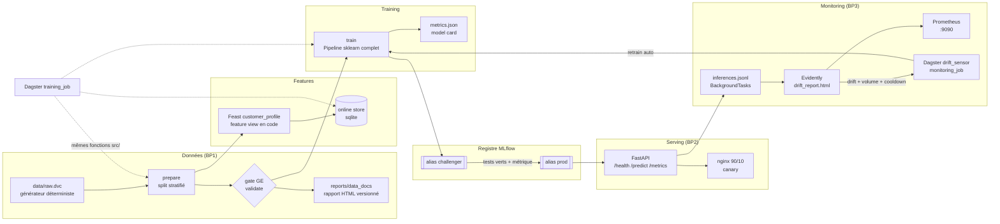

# mlops-template


Template MLOps réutilisable, agnostique cloud, conçu pour être adapté par client.

- **BP1 — training reproductible** : DVC (données), Feast (features), MLflow (expériences/registre), Dagster (orchestration).
- **BP2 — CI/CD modèle** : Great Expectations en gate bloquante, tests de modèle (métriques/invariance/comportement), promotion par alias MLflow, canary + rollback.
- **BP3 — monitoring & retrain loop** : inference logging JSONL, drift Evidently (data + prédiction), performance différée (vérité retardée), gauges Prometheus, arbitrage + sensor Dagster → réentraînement auto.

Le repo se construit pas à pas : chaque étape est un commit autonome, chaque
module a son README court. L'historique git est le support de formation.

## Architecture



## Quickstart — 9 commandes de zéro au canary

```bash
make setup     # 1. .venv uv + deps + .env + hooks pre-commit
make up        # 2. MLflow :5000 (docker compose)
make data      # 3. dataset simulé déterministe, versionné DVC
make train     # 4. prepare -> gate GE -> train -> registre (challenger)
make test      # 5. tests modèle : seuils + invariance + comportement
make promote   # 6. challenger -> prod (double gate + journal)
make serve     # 7. canary 90/10 : nginx :8090, stable :8001, canary :8002
make smoke     # 8. gate taux d'erreur (baseline stable vs mix)
make rollback  # 9. si besoin : prod -> version précédente + reload
```

Sortie attendue à l'étape 4 : run MLflow dans l'UI :5000, modèle
`churn-template` enregistré, alias `challenger` pointé, métriques dans
`metrics.json`. Étape 7 : `curl localhost:8090/health` renvoie la version
servie (`prod`).

## Structure

```
mlops-template/
├── data/                  # données versionnées via DVC (dvc.lock commité)
├── features/              # repo Feast (feature_store.yaml, feature views)
├── src/
│   ├── data/              # ingestion, validation GE, préparation
│   ├── features/          # définitions Feast + materialize
│   ├── training/          # entraînement, reporting, registre, promotion
│   ├── serving/           # API FastAPI + smoke-test canary
│   └── monitoring/        # hooks (emplacement réservé)
├── pipelines/             # assets/job Dagster (mêmes fonctions src/)
├── tests/                 # data/ model/ feast/ integration/
├── .github/workflows/     # ci.yml, cd-model.yml
├── docker/                # compose (MLflow, serving canary) + Dockerfiles
├── Makefile               # point d'entrée unique
├── dvc.yaml               # prepare -> validate -> train
├── params.yaml            # hyperparamètres + chemins + seuils (lus par DVC et Dagster)
└── docs/decisions.md      # ADR
```

## Commandes principales

| Commande                              | Rôle                                       |
| ------------------------------------- | ------------------------------------------ |
| `make setup`                          | venv uv + deps + `.env` + hooks pre-commit |
| `make up` / `make down`               | stack locale docker (MLflow)               |
| `make health`                         | healthcheck MLflow                         |
| `make lint` / `make format`           | ruff + mypy                                |
| `make precommit`                      | pre-commit sur tout le repo                |
| `make test` / `make test-integration` | pytest (unitaires / bout-en-bout)          |

`make help` liste tout.

## Pipeline DVC (étape 2)

```bash
make data      # génère le dataset de churn simulé (déterministe) + dvc add data/raw
make repro     # dvc repro : prepare -> validate -> train (dvc.lock tracé)
make metrics   # dvc metrics show
```

**Réactivité aux params** (testée, à reproduire chez un client) : `params.yaml` est en
dépendance des étapes DVC — chaque étape ne relance que si SA section change.

- `train.logreg.C: 1.0 -> 0.1` puis `make repro` : `prepare` skippé, seul `train`
  ré-exécuté (accuracy 0.7485 -> 0.7500 dans `dvc metrics diff`) ;
- retour à `C: 1.0` puis `make repro` : `Stage 'train' is cached` — les sorties
  exactes du premier run sont restituées depuis le cache DVC ;
- `make repro` sans changement : `Data and pipelines are up to date.` (idempotent).

Le contenu de `data/` vit dans le cache DVC ; git ne suit que les pointeurs
(`data/raw.dvc`, `dvc.lock`). Remote distant (S3/MinIO) : cf. `data/README.md`.

## Gate données — Great Expectations (étape 3)

`make repro` enchaîne prepare -> **validate** -> train. Le train ne s'exécute
que si la validation passe : le DAG DVC rend l'ordre structurel (`train` dépend
de `reports/data_docs`, l'out de `validate`).

- Suites définies **en code** (`src/data/expectations.py`) : schéma exact, plages,
  ensembles, distribution clé (taux de churn) — revues en PR comme du code.
- Rapport HTML **versionné** : `reports/data_docs/` est un out DVC (tracé dans
  `dvc.lock`), publié même quand la gate est rouge.
- Test de blocage (à refaire chez un client) :

  ```bash
  .venv/bin/python -m src.data.generate_raw --drift corrupt   # nulls + hors-plage + catégorie inconnue
  make repro        # -> [PIPELINE BLOQUÉ — gate GE] : détail par dataset et par colonne
  # recovery (dvc repro en échec réécrit le pointeur du dataset modifié) :
  git checkout -- data/raw.dvc dvc.lock && dvc checkout data/raw.dvc && dvc checkout
  make repro        # vert à nouveau
  ```

- Le drift de distribution (`--drift shift`) est bloqué aussi : l'expectation de
  moyenne sur la cible (`churn`) sort de ses bornes.

## Feature store — Feast (étape 4)

```bash
make feast-apply && make feast-materialize && make train-feast
```

Le feature view `customer_profile` expose exactement les features du training
DVC, depuis le parquet produit par `prepare`. `make train-feast` fit le même
pipeline via `get_historical_features` : métriques **bit-à-bit identiques**
au chemin fichiers (testé aussi en unitaire, repo Feast isolé).

### DVC vs Feast — quand utiliser quoi

| Situation                                                     | Choix                                        |
| ------------------------------------------------------------- | -------------------------------------------- |
| Training batch reproductible, une seule source                | CSV/parquet DVC (chemin par défaut du train) |
| Features partagées training ↔ serving temps réel             | Feast (`get_online_features`)                |
| Historique long + features calculées à la volée multi-équipes | Feast offline store (point-in-time correct)  |
| Données qui changent sans retraining                          | Feast (materialize régulier) > rebuild DVC   |

Dans ce template : **DVC = source de vérité batch, Feast = couche de serving**
de ces mêmes features. Un client "batch pur" peut désactiver Feast sans
toucher au training ; un client temps réel garde les deux, testés cohérents.

## Training + registre MLflow (étapes 5, 6, 8)

```bash
make train         # up + dvc repro : log MLflow (params/metrics/artefacts) + registre
make test          # inclut tests/model : seuils eval + invariance + comportement
make promote       # challenger -> prod si tests modèle verts ET métrique > champion
make rollback      # repointe prod vers la version précédente (journal)
```

Chaque entraînement enregistre une version de `churn-template` et pointe
l'alias **`challenger`** dessus. La promotion vers l'alias **`prod`** est une
décision séparée, sous double gate (tests modèle verts + roc_auc strictement
supérieur), journalisée dans `reports/promotions.md` (audit trail commité :
qui/quoi/quand/métriques). Sans `MLFLOW_TRACKING_URI`, MLflow écrit dans
`./mlruns` (store fichier) : le pipeline reste reproductible sans serveur.

## Orchestration Dagster (étape 7)

```bash
make dagster-dev   # UI Dagster — job training_job rejouable
make dagster-run   # exécution CLI du même job (sans UI)
```

Les assets Dagster appellent **le même code** que `dvc.yaml` (zéro
duplication) : prepare -> validate (GE) -> materialize Feast -> train +
evaluate -> promote. NB : la sélection d'assets se fait par clés
(`AssetSelection.assets`), jamais par string — le runtime ANTLR est figé à
4.9 par dvc->omegaconf et le parser de string de sélection exige 4.13.

## Serving canary + rollback (étape 10)

```bash
make serve         # stable :8001, canary :8002, nginx :8090 (90/10)
make smoke         # gate : taux d'erreur du mix vs baseline stable
make rollback      # alias prod -> version précédente + reload du serving
make serve-down    # arrête le serving (MLflow reste up)
```

Le modèle n'est **jamais baked dans l'image** : FastAPI le charge au
démarrage depuis le registre MLflow **par alias** (`prod`), avec la
signature validée au training. Le canary est le même service : sa
dégradation se simule avec `SERVE_FAILURE_CANARY=1` (le smoke-test doit
échouer, ~10 % d'erreurs). Le rollback repointe l'alias `prod` vers la
version antérieure du journal puis recrée les conteneurs — vérifiable en
une ligne : `curl localhost:8090/health` affiche la version servie.

## Monitoring & retrain loop — BP3

```bash
# 1. Trafic : le serving loggue chaque /predict (BackgroundTasks, JSONL).
make simulate-traffic ARGS="--mode nominal --n 500"        # baseline
make simulate-traffic ARGS="--mode data-drift --n 500"     # dérive features
make simulate-traffic ARGS="--mode concept-drift --n 500 --with-ground-truth /tmp/gt.csv"
# 2. Drift : Evidently (HTML) + verdict JSON (seuils params.yaml/monitoring).
make drift-report                        # sur les logs récents
make drift-report ARGS="--current data/prepared/test.csv --ground-truth /tmp/gt.csv"
# 3. Arbitrage : drift + volume (min_new_rows) + cooldown (24h).
make drift-check                          # décision seule (exit 2 = retrain requis)
make retrain-if-drifted                   # déclenche le training (cron/CI)
make monitoring-up                        # Prometheus :9090 (scrape /metrics)
make monitoring-run                       # job Dagster monitoring_job (sensor : 30 min)
```

Règles : trafic nominal → `dataset_drift=false`, pas de retrain ; trafic
dérivé → alerte + colonnes en faute (`monthly_fee`, `tenure_months`,
`num_support_calls`) → retrain si le volume le permet. Détail : ADR
`docs/adr/0004-monitoring-and-drift.md`, READMEs `src/serving/` et
`src/monitoring/`.

## CI / CD

- **CI** (`.github/workflows/ci.yml`) : lint (ruff+mypy), tests unitaires,
  intégration complète — dataset régénéré (déterministe), `dvc repro` (gate
  GE), tests modèle sur le challenger. MLflow **sans serveur** (sqlite) ;
  caches uv + DVC ; résumé métriques dans la PR ; rapport GE en artefact si
  échec.
- **CD modèle** (`.github/workflows/cd-model.yml`) : build image serving ->
  GHCR -> déploiement canary -> smoke-test -> **rollback automatique**
  (alias + recréation) si le canary échoue.

## Matrice de décision — passer à l'échelle chez un client

| Composant       | Template (local)                | Montée en charge                                             |
| --------------- | ------------------------------- | ------------------------------------------------------------ |
| Cache DVC       | `.dvc/cache` local              | remote S3/MinIO (`dvc remote add`, cf. `data/README.md`)     |
| MLflow backend  | sqlite + `--serve-artifacts`    | profil compose postgres, puis managed + artefacts S3         |
| MLflow registry | alias sur le serveur local      | même API : le serving ne change pas (alias `prod`)           |
| Feast store     | file + sqlite                   | offline sur data lake, online Redis/Postgres (mêmes repos)   |
| Orchestration   | `dagster dev` local             | Dagster Cloud/k8s : les assets et le job sont réutilisables  |
| Serving         | compose (nginx 90/10)           | même image en k8s : Canary/Argo rollouts pilotés par l'alias |
| Logs inférence  | JSONL local (`data/inferences`) | Parquet partitionné S3/MinIO (même contrat + prediction_id)  |
| Métriques       | Prometheus local (:9090)        | managed Prometheus/Grafana (mêmes noms de métriques)         |
| CI/CD           | GH Actions, runners GitHub      | self-hosted runner au choix — les jobs ne supposent rien     |

## Adapter ce template chez un client — checklist

1. `make setup && make test` : base verte avant toute modification.
2. Remplacer `src/data/generate_raw.py` par la vraie ingestion — garder le
   contrat de schéma (colonnes, types) et les parquets pour Feast.
3. Réécrire `src/data/expectations.py` sur les données réelles (plages,
   distributions, volumes minimaux) — la gate doit bloquer du vrai drift.
4. `params.yaml` : features réelles, hyperparamètres, seuils `eval`
   calibrés sur un premier training.
5. `features/feature_views.py` : entités métier du client (clés de jointure).
6. Secrets : `.env` local (jamais commité) + secrets GitHub pour CI/CD ;
   vérifier qu'aucune clé ne reste en dur (`detect-private-key` aide).
7. Renommer `train.model_name` (registre) et l'image serving par client.
8. `make train && make promote && make serve && make smoke` : boucle
   complète avant d'ouvrir la CI au client.
9. Brancher les remotes de la matrice ci-dessus au rythme des besoins —
   chaque brique se change sans toucher aux autres.

## État d'avancement

- [x] **Étape 1** — squelette reproductible (uv 3.11, pre-commit, compose MLflow, Makefile)
- [x] **Étape 2** — données versionnées DVC (dataset simulé, prepare/train, params.yaml)
- [x] **Étape 3** — gate GE bloquante (suites en code, rapport HTML versionné, blocage testé)
- [x] **Étape 4** — Feast local (feature view, materialize, chemin training équivalent)
- [x] **Étape 5** — training loggé MLflow (params/metrics/artefacts, registre, alias challenger)
- [x] **Étape 6** — tests modèle (seuils eval, invariance, comportement directionnel)
- [x] **Étape 7** — Dagster (assets partagés avec DVC, job training_job idempotent)
- [x] **Étape 8** — promotion challenger->prod (double gate, journal, rollback)
- [x] **Étape 9** — CI (lint, unitaires, intégration DVC+GE+modèle, caches, résumé PR)
- [x] **Étape 10** — serving FastAPI par alias, canary 90/10 nginx, smoke + rollback
- [x] **Étape 11** — documentation finale (architecture, ADR, matrice, checklist)
- [x] **BP3** — monitoring production : inference logging, drift Evidently, performance différée, Prometheus, retrain loop (Dagster sensor + CLI)
